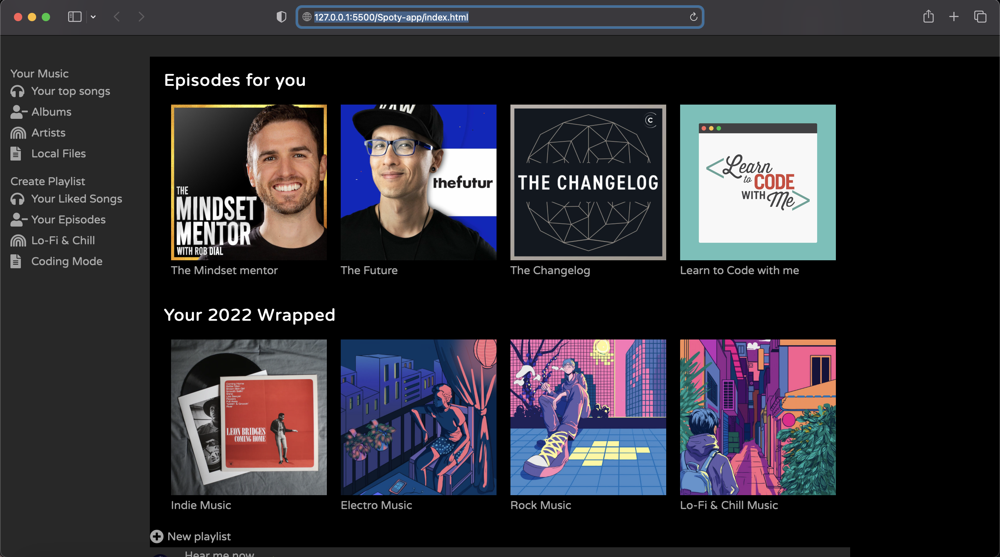

# Spotify App by Geri

- WMAD WEB DEV program

Spotify app created with HTML5 and CSS3 Flexbox and Grid

## App Evolution

## Program WMAD Web Dev Responsive Deisgn

### Technologies used

1. HTML
2. CSS
3. Javascript
4. Font Awesome
5. Google Fonts

## Author:

Geri

### References:

Images from Unsplash and Google Images
